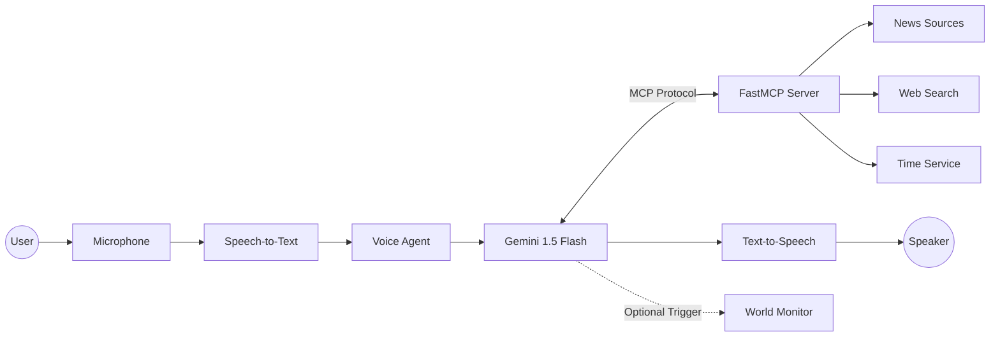

# F.R.I.D.A.Y.

> **Fast, Rather Intelligent Digital Assistant for You**

An Iron Man-inspired AI assistant architecture built around real-time voice interaction and intelligent tool orchestration. Rather than functioning as a traditional chatbot, F.R.I.D.A.Y. is designed as a modular AI ecosystem where a dedicated Voice Agent and a high-performance MCP Server work together to understand requests, execute tasks, and deliver natural, context-aware conversations.

Inspired by Marvel's iconic AI assistant, F.R.I.D.A.Y. combines modern voice AI, live information retrieval, and extensible tooling into a seamless conversational experience.

---

## Overview

F.R.I.D.A.Y. is built on a modular architecture that separates conversational intelligence from execution capabilities.

The **Voice Agent** is responsible for listening, reasoning, and speaking, while the **MCP Server** exposes tools, resources, and workflows that allow the agent to interact with the outside world. This separation enables scalable, maintainable, and extensible AI applications.

Whether it's delivering your morning news briefing, retrieving live information from the web, or launching an interactive dashboard, F.R.I.D.A.Y. is designed to behave like a capable AI operating companion rather than simply answering questions.

---

## Architecture

F.R.I.D.A.Y. consists of two independent services communicating through the **Model Context Protocol (MCP)**.

| Component | Responsibility | Entry Point |
| ---------- | -------------- | ----------- |
| **Voice Agent** | Handles speech recognition, reasoning, conversation management, and speech synthesis. | `uv run friday_voice` |
| **MCP Server** | Provides tools, prompts, resources, and system capabilities to the Voice Agent. | `uv run friday` |

This separation allows the conversational layer and the execution layer to evolve independently while remaining tightly integrated.

---

## Request Flow



---

## Capabilities

### Real-Time Voice Conversations

Designed for natural, low-latency conversations using modern speech recognition and speech synthesis.

### Intelligent Tool Calling

Utilizes the Model Context Protocol (MCP) to interact with external services, execute tools, retrieve resources, and automate workflows.

### Global News Briefings

Aggregates headlines from multiple trusted news sources to generate concise, AI-powered summaries that keep you informed.

### Live Information Retrieval

Searches the web and retrieves real-time information whenever up-to-date knowledge is required.

### Context-Aware Automation

Automatically launches supporting applications and dashboards when appropriate, creating a more immersive assistant experience.

### System Awareness

Provides access to system time, diagnostics, and local resources through dedicated MCP tools.

---

## Technology Stack

| Layer | Technology |
| ------- | ---------- |
| Agent Framework | FastMCP, LiveKit Agents |
| Language Model | Google Gemini 1.5 Flash |
| Speech-to-Text | Sarvam Saaras v3 |
| Text-to-Speech | Sarvam Bulbul v3, OpenAI Nova |
| Communication | HTTP/SSE using the Model Context Protocol |
| Runtime | Python 3.11+ |

---

## Getting Started

### Prerequisites

- Python 3.11 or later
- `uv` (recommended package manager)
- LiveKit Cloud account (Free tier supported)

### Installation

Clone the repository.

```bash
git clone https://github.com/BM-6337/Project-FRIDAY.git
cd Project-FRIDAY
```

Install project dependencies.

```bash
uv sync
```

### Configuration

Create a `.env` file from the provided example.

```bash
cp .env.example .env
```

Configure the following environment variables:

- `LIVEKIT_URL`
- `LIVEKIT_API_KEY`
- `LIVEKIT_API_SECRET`
- `GOOGLE_API_KEY`
- `SARVAM_API_KEY`

---

## Running F.R.I.D.A.Y.

Both services must be running simultaneously.

### Start the MCP Server

```bash
uv run friday
```

The server exposes an SSE endpoint at:

```
http://127.0.0.1:8000/sse
```

### Start the Voice Agent

```bash
uv run friday_voice
```

The Voice Agent connects to your configured LiveKit room.

To begin interacting with the assistant, open the LiveKit Agents Playground and connect to your room.

---

## Project Structure

```text
friday/
├── FRIDAY.py             # Main voice assistant
├── server.py             # FastMCP server exposing tools and resources
├── .env.example          # Environment variables template
├── pyproj.toml           # Project configuration
├── uv.lock               # Locked dependencies
├── .gitignore
├── LICENSE
└── README.md
```

---

## Roadmap

- Additional MCP tool integrations
- Calendar and productivity tools
- Memory and long-term context
- Multi-agent collaboration
- Smart home integrations
- Desktop automation
- Local LLM support
- Vision capabilities
- Cross-platform deployment

---

## License

This project is licensed under the MIT License
